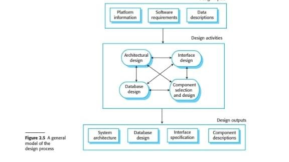

# Software Design Process

This repository provides an overview of a general model of the software design process, including key activities and their outputs. The model covers the fundamental phases of architectural design, database design, interface design, and component selection.

## Design Inputs
1. **Platform Information**: Hardware, operating system, and infrastructure details.
2. **Software Requirements**: Functional and non-functional requirements.
3. **Data Descriptions**: Data structure and storage details.

## Design Activities
1. **Architectural Design**: Defines the high-level structure of the system.
2. **Database Design**: Specifies how data will be stored, accessed, and managed.
3. **Interface Design**: Describes user interaction components.
4. **Component Selection and Design**: Decides on the modules or components needed and their specifications.

## Design Outputs
1. **System Architecture**: The overall structure of the software system.
2. **Database Design**: Detailed database schema and entity relationships.
3. **Interface Specification**: Detailed design of user interfaces.
4. **Component Descriptions**: Specifications for individual components.

## Usage
Each design phase has its own documentation and folder with detailed explanations, examples, and references. Follow the guidelines in each section to understand the outputs and methods used for each design activity.
